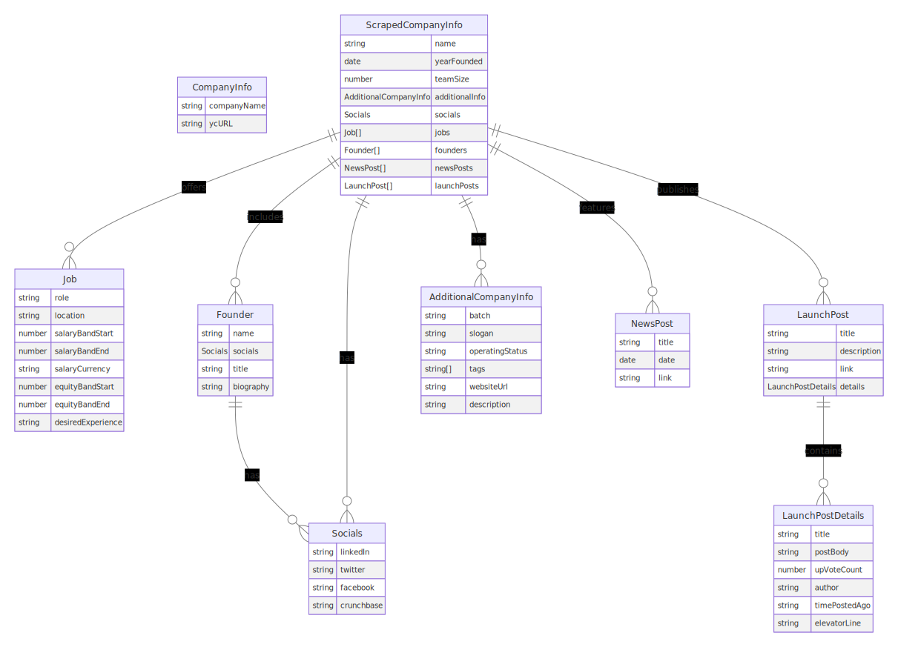

# Web Scraping Project: Extracting Data from Y Combinator Startups

Welcome to my Web Scraping project! As part of my full-stack development exploration, I created this project to delve into the world of web scraping and data extraction. The focus here is on scraping public pages of Y Combinator (YC) startups and structuring the extracted data into a JSON format.

## Project Goals

The primary objective of this project is to:

1. Scrape public profiles of YC startups from the YC website.
2. Extract key information about each company into a structured format.
3. Output the collected data into a JSON file stored in the `out/` folder.

## Implementation Details

### Tech Stack

- TypeScript for robust, type-safe coding.
- Crawlee for efficient web scraping, specifically using CheerioCrawler.
- Cheerio for effective HTML parsing.
- Fast-csv for parsing CSV files.
- fs and fs-extra for file system operations.

### Process

1. **Parsing Company List**: The process begins by parsing a list of YC company names and URLs from a CSV file (`inputs/companies.csv`), using the fast-csv library.
2. **Scraping Company Profiles**: Utilizing Crawlee's CheerioCrawler, I scrape each company's profile from the YC website. This crawler is configured for optimal scraping efficiency, with controlled request rates and concurrency.
3. **Data Extraction**: With Cheerio, I parse the HTML content of each company's page to extract structured data. This includes comprehensive details like the company name, founding year, team size, job openings, founder information, social media links, and more.
4. **Handling Additional Details**: The script also captures launch post details and news stories related to the company. For launch posts, additional scraping requests are queued and processed to extract detailed information from individual launch pages.
5. **Structuring Data**: All extracted data is structured into comprehensive TypeScript interfaces, ensuring a consistent and detailed data format.
6. **Outputting JSON**: The final step involves compiling the structured data for each company into a JSON file (`out/scraped.json`). The output directory is managed using fs-extra to ensure proper file handling.


## Data Schema

The data schema for each scraped company is extensive, capturing a wide range of information.

- Basic company details like `name`, `yearFounded`, and `teamSize`.
- `additionalInfo` containing the company's batch, slogan, operating status, tags, website URL, and description.
- An array of `jobs`, each with details such as role, location, salary band, equity band, and desired experience.
- `founders` information, including name, title, biography, and social media links.
- `launchPosts`, capturing title, description, link, and detailed post information such as upvote count, author, time posted, elevator line, and post body.
- `newsPosts` related to the company, each with title, date, and link.
- Company `socials` like LinkedIn, Twitter, Facebook, and Crunchbase links.



## Enhanced Development Practices

In this web scraping project, I've not only focused on the primary functionalities but also placed a significant emphasis on enhancing code quality, maintainability, efficiency, and the effectiveness of the scraping process.

### Emphasis on Code Quality and Efficiency

- **Comprehensive Documentation**: Utilizing VSCode's capabilities, I've ensured that each helper function is accompanied by JSDoc comments for clarity. This practice, as outlined in [this StackOverflow guide](https://stackoverflow.com/a/42805312), aids in understanding and maintaining the codebase.

- **Asynchronous Programming**: The project extensively uses Promises and the async/await syntax, favoring these modern constructs over traditional callbacks for improved code clarity and error handling.

- **Functional Programming Techniques**: Instead of imperative loops, I've employed functional programming methods like `map`, `reduce`, and `filter`.

- **Leveraging TypeScript Features**: I wanted to learn more about TypeScript through this project, so the I tried to leverage TypeScript whenever possible. I commonly used TypeScript generics and interfaces to enhance type safety and ensure a more robust and scalable code structure.

- **Code Formatting with Prettier**: To maintain a consistent coding style, I've integrated Prettier.

### Scraping Optimization

- **Crawler Configuration**: I've configured Crawlee to prevent issues like rate-limiting or IP bans, to create a more robust scraping process.

- **Extensive Data Extraction**: A key focus has been to extract and structure as much data as possible from the HTML pages, maximizing the value and comprehensiveness of the scraped information.

## Testing and Verification

To guarantee the accuracy and robustness of the scraping process, I used the following testing process.

### Script-Based Testing

To actively test the scraping functionality, I employ the following command:

```sh
tsx runner.ts
```

Executing this command initiates `runner.ts`, a script that orchestrates the entire scraping process from start to finish. It covers every aspect of the workflow, including parsing the company list, scraping data from the YC website, and generating the final JSON output.

### TypeScript Compiler Checks

```sh
npx tsc
```