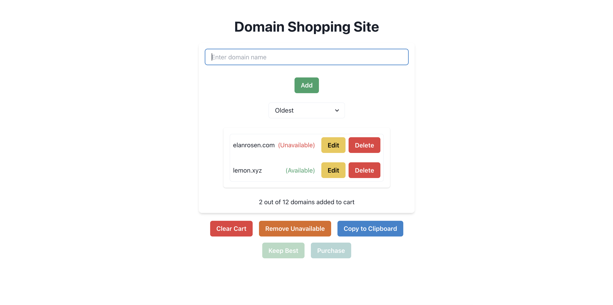
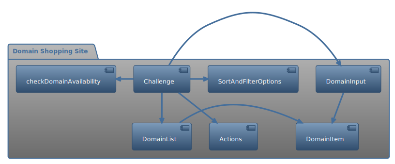

# Frontend Development with React and Chakra UI

Welcome to the third segment of my full-stack development exploration! In this project, I focused on honing my frontend skills using React, Next.js, TypeScript, and Chakra UI. The objective was to create a user-friendly shopping cart interface for domain purchases, incorporating modern web development practices and tools.

## Project Goals

The goal of this project was to develop an interactive and responsive web application with the following features:

1. **Domain Purchase Shopping Cart**: Implement a shopping cart where users can add, view, delete, and manage domain names they intend to purchase.
2. **Responsive Design**: Ensure the application is functional and visually appealing across various devices and screen sizes.
3. **Interactive UI Components**: Utilize Chakra UI to build a user interface that's not only functional but also aesthetically pleasing and intuitive to use.

## Deployment

This project is currently deployed and accessible via AWS. You can interact with the live application here: [Domain Shopping Cart](https://main.d3dvm7vdkjxj45.amplifyapp.com/).




## Implementation Details

### Tech Stack

- **React and Next.js**: Utilized for building a scalable and efficient single-page application, with Next.js enhancing SEO and server-side rendering capabilities.
- **TypeScript**: Employed for type-safe coding, which enhances code robustness and maintainability.
- **Chakra UI**: Used for designing a responsive and modern user interface, leveraging its component library for a consistent look and feel.
- **Node.js**: Integral for managing package dependencies and facilitating various development scripts.

### Process

1. **Component Development**: Developed a primary `Challenge` component, supplemented by multiple sub-components such as `Actions`, `DomainInput`, `DomainList`, `DomainItem`, and `SortAndFilterOptions`.



2. **State Management**: Extensively used React hooks like `useState`, `useMemo`, `useCallback`, and `useClipboard` for managing the state. This included handling domains, their availability, user input, and clipboard operations.
3. **Responsive Design**: Leveraged Chakra UI's responsive design features to ensure the application's usability across different devices and screen sizes. Used breakpoints to adapt layout and styling dynamically.
4. **API Integration**: Integrated a mock API (`checkDomainAvailability`) for checking the availability of domain names, simulating real-world asynchronous data fetching.
5. **Interactive Features**: Implemented features such as adding, editing, and deleting domain entries, copying domain lists to the clipboard, sorting, and prioritizing domains. Added functionalities like loading states and error handling.
6. **Dynamic UI/UX Enhancements**: Incorporated tooltips for better user guidance, a spinner for loading states, and validation error messages for input fields.
7. **Data Validation and Processing**: Implemented domain validation using regular expressions and custom logic for domain sorting and prioritization, demonstrating functional programming techniques.
8. **Error Handling and User Feedback**: Provided clear user feedback through error messages and interactive button states.

### Emphasis on Code Quality and Efficiency

In this project, I've not only concentrated on the core functionalities but also devoted considerable effort to elevating the code quality, maintainability, and user experience. These practices ensure the application is not only functional but also robust and user-friendly.

- **Usability Features**: Integrated helpful error messages, loading states, confirmation dialogs, and informative help text to enhance user interaction. Implemented advanced features like an undo button, and filtering/sorting options for a more dynamic user experience.

- **Modular Component Design**: Emphasized creating numerous small, reusable React components, which improves code organization and fosters scalability.

- **Comprehensive Documentation**: Each helper function is  documented using JSDoc comments, automatically generated by VSCode. This practice, as detailed in [this StackOverflow guide](https://stackoverflow.com/a/42805312).

- **Asynchronous Programming**: Employed Promises and async/await syntax extensively for clearer and more efficient code, avoiding the complexities of callback-based structures.

- **Functional Programming Paradigms**: Adopted functional programming techniques, preferring constructs like `map`, `reduce`, and `filter` over imperative `for` loops, aligning with React's immutable style.

- **TypeScript Integration**: Fully utilized TypeScript features including generics and interfaces, enhancing type safety and ensuring robust and scalable code structure.

- **Code Quality with Immutable Data Types**: Used `immutable`'s data types like `Set`, `List`, and `Map` to comply with React's immutable style and improve state management.

- **Code Formatting and Standards**: Incorporated Prettier for auto-formatting the code, ensuring consistency and adherence to standard coding styles. The Prettier [VSCode plugin](https://github.com/prettier/prettier-vscode) has been invaluable in this regard.

## Testing

### Development Server

Make sure to start with npm install, then run the following command to start the development server and view the application:

```sh
npm run dev
```

### Build and Lint Tests

To ensure code quality and build integrity, use these commands:

```sh
npm run build  # Checks if the code builds correctly
npm run lint   # Ensures no lint errors
npx tsc        # Validates TypeScript typings
```

## Project Structure

- `src/components/challenge.tsx`: The main component file where most of the development took place.
- `components/`: Directory for storing sub-components used in the application.
- `src/pages/index.tsx`: The entry point for the Next.js application.

This project was a significant step in my learning journey, allowing me to explore and integrate various modern web technologies and practices into a cohesive and functional application.